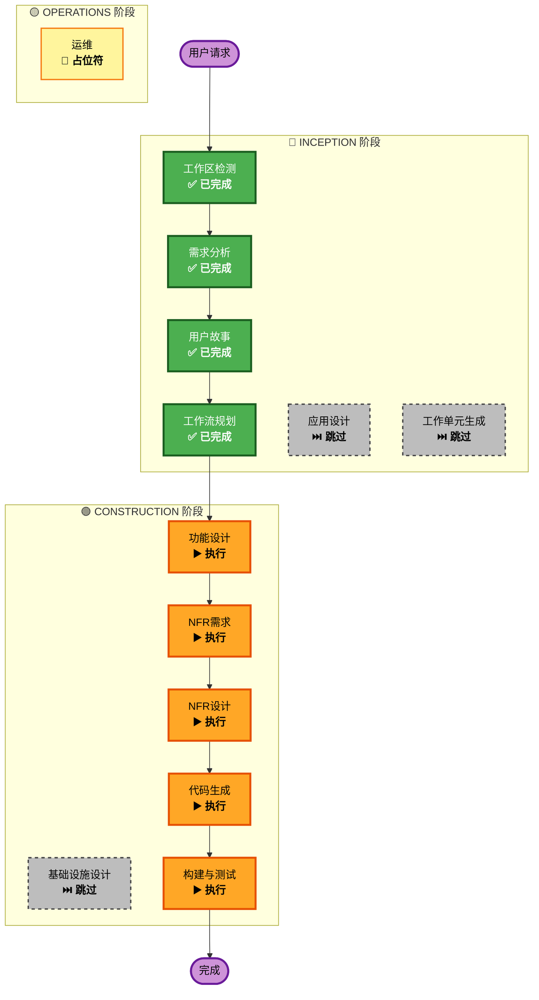

# 执行计划

## 详细分析摘要

### 变更影响评估
- **用户影响**: 是 - 三种用户角色直接使用系统
- **结构变更**: 是 - 全新系统架构
- **数据模型变更**: 是 - 需要设计商品、用户、审核记录等数据模型
- **API变更**: 是 - 需要设计全新的REST API
- **NFR影响**: 是 - 有明确的性能、安全、可用性需求

### 风险评估
- **风险级别**: 中等
- **回滚复杂度**: 简单（全新项目）
- **测试复杂度**: 中等

---

## 工作流可视化

---

## 待执行阶段

### 🔵 INCEPTION 阶段
- [x] 工作区检测 (已完成)
- [x] 需求分析 (已完成)
- [x] 用户故事 (已完成)
- [x] 工作流规划 (已完成)
- [ ] 应用设计 - **跳过**
  - **理由**: 系统结构相对简单，可在功能设计阶段直接定义组件
- [ ] 工作单元生成 - **跳过**
  - **理由**: 单一系统，无需拆分为多个工作单元

### 🟢 CONSTRUCTION 阶段
- [ ] 功能设计 - **执行**
  - **理由**: 需要定义数据模型、业务逻辑和API接口
- [ ] NFR需求 - **执行**
  - **理由**: 有明确的性能、安全、可用性需求
- [ ] NFR设计 - **执行**
  - **理由**: 需要设计认证、授权、日志等非功能性实现
- [ ] 基础设施设计 - **跳过**
  - **理由**: 本地服务器部署，无需云基础设施设计
- [ ] 代码生成 - **执行** (始终)
  - **理由**: 需要生成后端和前端代码
- [ ] 构建与测试 - **执行** (始终)
  - **理由**: 需要构建指令和测试策略

### 🟡 OPERATIONS 阶段
- [ ] 运维 - **占位符**
  - **理由**: 未来部署和监控工作流

---

## 预估时间线
- **总阶段数**: 5个待执行阶段
- **预估工期**: 中等复杂度项目

## 成功标准
- **主要目标**: 实现完整的两级商品审核系统
- **关键交付物**: 
  - 后端API服务 (Spring Boot)
  - 前端应用 (React)
  - 数据库设计 (MySQL)
  - 测试用例
- **质量门禁**:
  - 所有用户故事验收标准通过
  - API响应时间 < 2秒
  - 支持50并发用户
